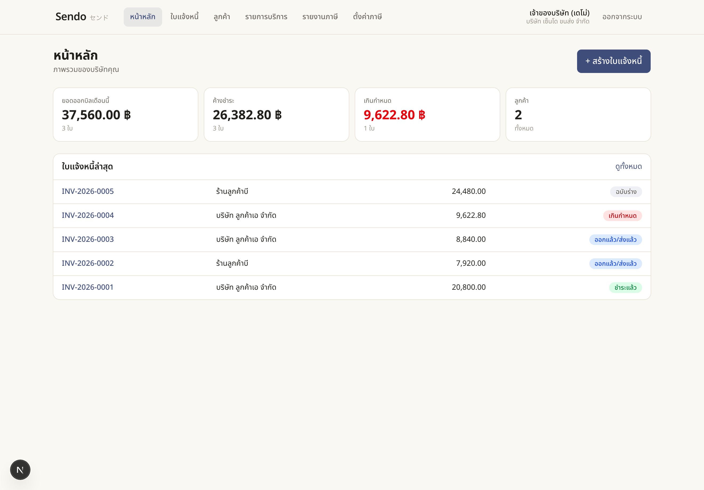
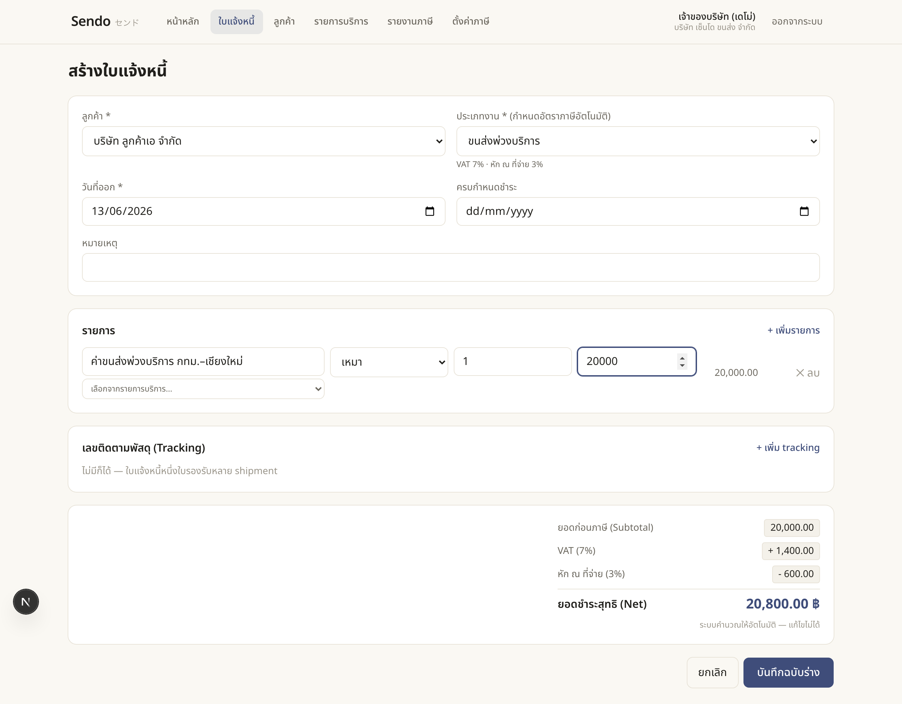
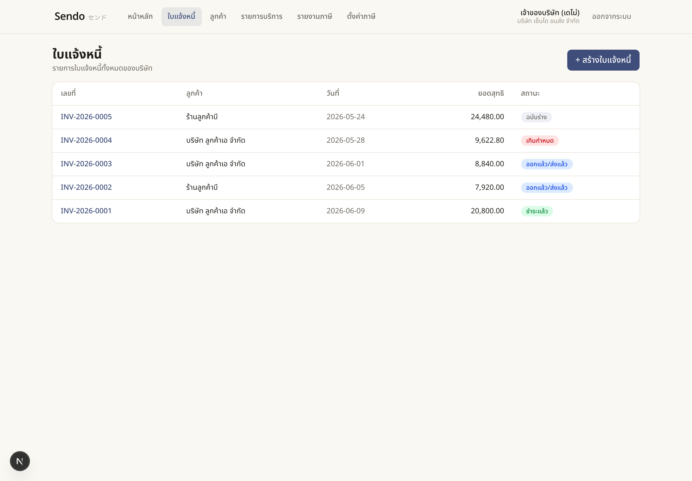
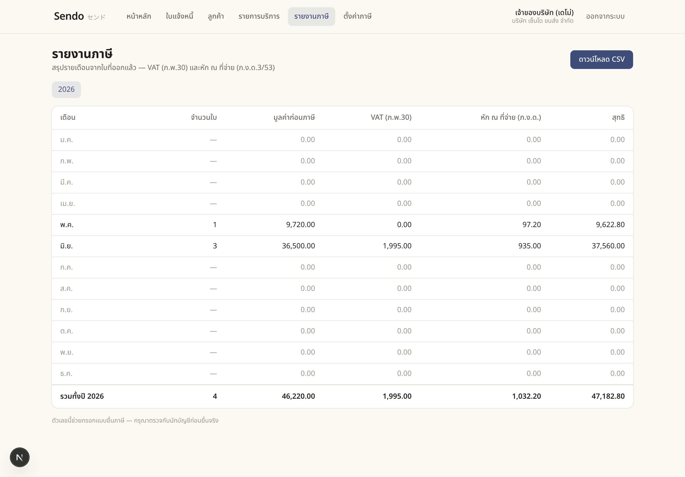
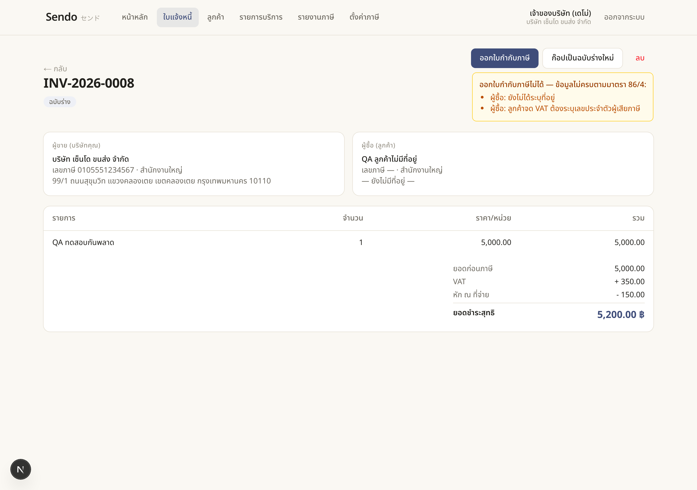
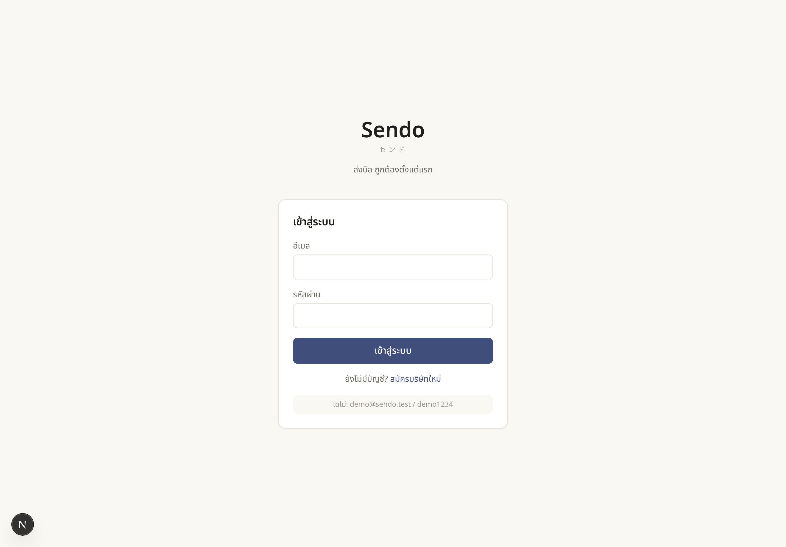

# Sendo（センド）— Thai logistics invoicing

[](https://github.com/Tasachii/Sendo/actions)
[](LICENSE)
[](https://github.com/Tasachii/Sendo/actions/workflows/ci.yml)

Sendo is a multi-tenant web app for issuing Thai tax documents — full tax invoices (ใบกำกับภาษี) and withholding-tax certificates (ใบหัก ณ ที่จ่าย / 50 ทวิ) — built for logistics and transport companies. Pick a customer and a job type; the tax engine derives VAT, withholding tax, and net payable and renders them read-only, so nobody mistypes a total. Money is stored as integer satang (baht × 100) and every total is recomputed on the server on every save — a tampered request cannot change what is billed. The same data flows straight into the PDFs, and a document cannot be issued until it satisfies the eight mandatory fields of มาตรา 86/4. Each company's data is fully isolated behind structural tenant guards; the whole app runs on a single local SQLite file with no cloud account required.

**Live demo** — [tasachii.github.io/Sendo](https://tasachii.github.io/Sendo/) (client-only invoice flow; full app is server-based) · **Issues** — [github.com/Tasachii/Sendo/issues](https://github.com/Tasachii/Sendo/issues)

---

## Screenshots

| Dashboard — month / unpaid / overdue | Create invoice — live read-only totals |
| --- | --- |
|  |  |

| Invoice list with statuses | Monthly tax report (ภ.พ.30 / ภ.ง.ด.) |
| --- | --- |
|  |  |

| Poka-yoke blocks an invalid issue | Sign in |
| --- | --- |
|  |  |

---

## What it is

Logistics billing is where the expensive mistakes happen: the wrong withholding rate (1% for pure transport vs. 3% for transport-plus-service), VAT typed by hand, or a tax invoice missing a field the Revenue Department requires. Most teams handle this in Excel and catch errors after the customer disputes them.

Sendo follows **poka-yoke（ポカヨケ）** — ส่งบิล ถูกต้องตั้งแต่แรก — prevent mistakes by design, not by catching them later: anything the system can compute is read-only, anything that must be chosen is a dropdown, and a document that breaks มาตรา 86/4 simply cannot be issued.

Sendo issues the full Thai document suite from one engine, with automatic VAT **and discount**, a company logo/seal/signature on every PDF, and a conversion workflow a one-off generator cannot offer — a quotation becomes an invoice becomes a receipt in one click, each numbered, audited, and rolled into the tax report.

| Document | Type | Series | Counts in VAT report |
| --- | --- | --- | --- |
| ใบเสนอราคา | `QUOTATION` | `QUO-` | — |
| ใบแจ้งหนี้ / ใบวางบิล | `BILLING_NOTE` | `BILL-` | — |
| ใบกำกับภาษี / ใบแจ้งหนี้ | `TAX_INVOICE` | `INV-` | ✓ |
| ใบเสร็จรับเงิน / ใบกำกับภาษี | `RECEIPT` | `REC-` | — |
| ใบรับรองแทนใบเสร็จรับเงิน | `RECEIPT_SUBSTITUTE` | `RCS-` | — |
| ใบลดหนี้ | `CREDIT_NOTE` | `CN-` | — |
| ใบเพิ่มหนี้ | `DEBIT_NOTE` | `DN-` | — |
| หนังสือรับรองหัก ณ ที่จ่าย (50 ทวิ) | derived from any tax document | — | reported via ภ.ง.ด. |

- **Stack** — Next.js 16 · React 19 · TypeScript · Prisma 6 · SQLite · NextAuth 4 · Tailwind v4 · Zod · @react-pdf/renderer · pdf-lib + @signpdf (e-Tax) · Vitest

---

## Installation

**Requirements** — [Node 20+](https://nodejs.org) (tested on Node 20 in CI; `node -v` to check)

**Mac / Linux**
```bash
git clone https://github.com/Tasachii/Sendo.git
cd Sendo
cp .env.example .env          # then set NEXTAUTH_SECRET (openssl rand -base64 32)
npm install                   # installs deps, runs prisma generate via postinstall
npx prisma migrate dev        # create the local SQLite database
npm run seed                  # load demo data (two companies)
```

**Windows**
```bat
git clone https://github.com/Tasachii/Sendo.git
cd Sendo
copy .env.example .env         :: then set NEXTAUTH_SECRET
npm install                    :: installs deps, runs prisma generate via postinstall
npx prisma migrate dev         :: create the local SQLite database
npm run seed                   :: load demo data (two companies)
```

---

## Running

```bash
npm run dev              # start the app on http://localhost:3000
npm run build            # type-check + bundle every route (same step CI runs)
npm start                # serve the production build locally
npm run lint             # ESLint across the project
npm test                 # Vitest — 186 tests across 21 files
npm run test:coverage    # same suite + v8 coverage report (gates CI thresholds)
npm run test:watch       # Vitest in watch mode
npm run db:migrate       # prisma migrate dev — apply new migrations
npm run db:push          # prisma db push — sync schema without a migration file
npm run db:studio        # open Prisma Studio to inspect the database
npm run seed             # reset demo data (two companies)
```

Demo accounts created by `npm run seed`:

| Role | Email | Password |
| --- | --- | --- |
| Demo company (OWNER) | `demo@sendo.test` | `demo1234` |
| Second tenant (proves isolation) | `other@sendo.test` | `demo1234` |

---

## Usage

1. **Sign in (demo).** Run `npm run dev`, open `http://localhost:3000`, sign in as `demo@sendo.test` / `demo1234`.
2. **Set up the company (one time).** Open **ตั้งค่า** to confirm the company identity and upload a **logo / ตราประทับ / ลายเซ็น** — they render on every document PDF. Tune VAT and withholding rates per job type here too; rates are data, not code.
3. **Add a customer (one time).** Open **ลูกค้า → + เพิ่มลูกค้า**. Enter tax ID, address, and branch; press **บันทึก** (Save). The details reuse on every future document.
4. **Create a document.** Go to **เอกสาร → + สร้างเอกสาร** and pick a type — e.g. *ใบเสนอราคา*. Choose **ลูกค้า** and **ประเภทงาน**, add line items (each with an optional **ส่วนลด**), and an optional whole-bill discount. Watch **ยอดชำระสุทธิ** settle automatically. Press **บันทึกฉบับร่าง**.
5. **Issue the document.** Press the type's issue button (e.g. **ออกใบกำกับภาษี**). If a required field is missing, the action is blocked and the missing items are listed in Thai. For a full tax invoice the มาตรา 86/4 eight-field gate runs; lighter documents use a lighter gate.
6. **Convert it.** From an issued quotation press **แปลงเป็นใบกำกับภาษี**; from an issued invoice press **แปลงเป็นใบเสร็จรับเงิน**. The new document copies the lines and links back to its source — the lineage shows on both.
7. **Download.** Download the **PDF**, the **50 ทวิ** withholding certificate when WHT applies, or the **e-Tax** export (signed PDF/A-3 when a certificate is configured, otherwise the ขมธอ.3-2560 XML).
8. **Verify tenant isolation.** Sign in as `other@sendo.test` and confirm none of the first company's data is visible.

Statuses: **ฉบับร่าง** · **ออกแล้ว/ส่งแล้ว** · **ชำระแล้ว** · **เกินกำหนด** · **ตอบรับแล้ว** · **ปฏิเสธ** · **หมดอายุ** · **ยกเลิก**

---

## Architecture

```
Browser ──▶ Next.js 16 (App Router) ──▶ Prisma ──▶ SQLite (prisma/dev.db)
                │  server actions recompute every total (incl. discounts) via lib/tax.ts
                │  one Invoice table, discriminated by docType (lib/docTypes.ts)
                ├─ NextAuth (JWT: companyId + role) · proxy.ts gates routes
                └─ /api/invoices/[id]/pdf · /wht · /etax ──▶ @react-pdf/renderer (Sarabun)
                                                         └─ pdf-lib + @signpdf (e-Tax PDF/A-3 + PAdES)
```

| Topic | Decision |
| --- | --- |
| Money is server-truth | Every save recomputes subtotal, VAT, WHT, and net via `lib/tax.ts` from the company's `TaxSetting` — a tampered client request cannot change what is billed. |
| Integer satang | All amounts stored as integer satang (baht × 100). Rounding is half-away-from-zero applied to VAT and WHT only; net is exact integer arithmetic. No floating-point drift. |
| Tenant isolation is structural | Every update and delete uses `where: { id, companyId }` — a forged ID can never reach another company's row. Enforced by `requireSession()` / `requireWriter()` from `lib/tenant.ts`. |
| Poka-yoke on issue | `issueInvoice` runs the มาตรา 86/4 eight-field check before changing status. Anything missing is returned as a Thai error list; the document stays DRAFT. |
| Atomic, per-series numbers | `TAX_INVOICE` keeps the legacy `InvoiceCounter` (`INV-`); every other type uses a `DocumentCounter(companyId, series, year)`. Both increment inside a transaction, so concurrent issues never collide and a deleted draft never re-issues its number. |
| One document engine | All seven types share the `Invoice` table, discriminated by `docType`. `lib/docTypes.ts` is the single source of truth for each type's title, series, status machine, issue gate, and conversion edges. |
| Discounts are server-truth | Per-line and whole-document discounts resolve to integer satang and clamp to `[0, base]` in `computeTotals` before `lib/tax.ts` runs — VAT and WHT compute off the post-discount base. The tax engine's tested contract is untouched. |
| Conversion keeps lineage | `convertDocument` clones items + discounts into a fresh DRAFT of the target type, links `sourceId`, and audits it. The detail page shows both directions of the chain. |
| Branding in the database | Logo / seal / signature are stored as validated base64 data URLs on `Company` (≤300 KB, PNG/JPG) — no filesystem or volume dependency, so PDFs carry branding on any host. |
| Rates as data, not code | Withholding and VAT rates live in `TaxSetting` (editable in **ตั้งค่าภาษี**). Correcting a rate never requires a deploy. Seeded defaults: ขนส่งล้วน 1% · ขนส่งพ่วงบริการ 3% · ค่าเช่า 5% · ค่าโฆษณา 2%. |
| WHT rate on 50 ทวิ derived from stored amounts | `whtRatePct` is computed from the stored satang values at PDF time — a rate edit after issue cannot change the printed rate on a legal certificate already issued. |
| Bundled Thai font | Sarabun ships in the repo under `public/fonts`. PDFs render Thai correctly with no network call, and align with the ETDA e-Tax reference font (THSarabun). |
| SQLite for local dev | Single-file database, no external service. Migrate to PostgreSQL for production (see Roadmap). |
| State machine for invoice status | `DRAFT→SENT` (issue only) · `SENT→{PAID,OVERDUE}` · `OVERDUE→{PAID,SENT}` · `PAID→OVERDUE`. A legally-issued document can never be reverted to DRAFT. |
| Delete restricted to OWNER + DRAFT | Hard-deleting an issued tax document destroys the audit trail. Only an OWNER may delete, and only while the invoice is still DRAFT. |

---

## Configuration

### Environment variables

| Variable | Default | Purpose |
| --- | --- | --- |
| `NEXTAUTH_URL` | `http://localhost:3000` | Base URL for NextAuth callbacks |
| `NEXTAUTH_SECRET` | — | Session signing secret — generate with `openssl rand -base64 32` |
| `ETAX_PFX_BASE64` | — | Optional. Base64 of the seller's PKCS#12 (.pfx) certificate. When set with the passphrase, `/api/invoices/[id]/etax` returns a PAdES-signed PDF/A-3; otherwise it returns the ขมธอ.3-2560 XML. |
| `ETAX_PFX_PASSPHRASE` | — | Optional. Passphrase for the e-Tax certificate above. |

The SQLite path is set in `prisma/schema.prisma` (`file:./dev.db`).

### Tax engine defaults

Seeded into `TaxSetting` per company. Editable in **ตั้งค่าภาษี** without a code change.

| Job type key | Label | VAT | WHT |
| --- | --- | --- | --- |
| `transport_only` | ขนส่งล้วน (จดทะเบียนขนส่ง) | ยกเว้น (exempt) | 1% |
| `transport_service` | ขนส่งพ่วงบริการ | 7% | 3% |
| `service` | ค่าบริการ / รับจ้างทำของ | 7% | 3% |
| `rent` | ค่าเช่า | 7% | 5% |
| `advertising` | ค่าโฆษณา | 7% | 2% |
| `custom` | กำหนดเอง | 7% | 3% |

> Pure domestic transport (ขนส่งในราชอาณาจักร) is **VAT-exempt** under Revenue Code §81(1)(ณ); only transport bundled with other services is standard-rated. These keys and rates are the literals seeded from `lib/taxDefaults.ts` — a drift test (`tests/readme-rates.test.ts`) fails if this table and that file disagree.

WHT threshold: no withholding when subtotal < 1,000 baht (100,000 satang) per Thai Revenue rule §2.1.4.

---

## CI

GitHub Actions runs on every push and pull request to `main`:

1. `npm run lint` — ESLint across the project (zero errors).
2. `npm run test:coverage` — full 186-test suite + v8 coverage thresholds (gates the PR).
3. `npm run build` — type-check + bundle every route.

Node 20 · Ubuntu latest · `npm ci` for reproducible installs.

---

## Roadmap

- [x] Phase 1 — auth + tenant isolation, Customer/Service CRUD, create-invoice with live totals, poka-yoke มาตรา 86/4 issue gate, tax invoice + 50 ทวิ PDFs, atomic numbering, audit log
- [x] Phase 2 — pricing modes (FLAT / WEIGHT / DISTANCE), copy-invoice, multi-shipment tracking, dashboard (month / unpaid / overdue), auto-OVERDUE
- [x] Phase 3 partial — monthly ภ.ง.ด./ภ.พ.30 summary with CSV export, e-Tax XML builder/validator and carrier state mapper (unit-tested stubs)
- [x] **Document suite** — quotation, billing note, tax invoice, receipt, receipt-substitute, credit/debit note on one engine, with per-series numbering and type-aware issue gates
- [x] **Discounts** — per-line and whole-document discounts in the tax engine, form, and PDF
- [x] **Conversion workflow** — quotation → invoice → receipt (and tax invoice → credit/debit note), with lineage links
- [x] **Branding** — company logo / seal / signature rendered on every document PDF
- [x] **e-Tax export** — Invoice → ขมธอ.3-2560 XML, with a pluggable PAdES + PDF/A-3 signer (`pdf-lib` + `@signpdf`); supply a real certificate via `ETAX_PFX_BASE64` to emit signed files. Validate against ETDA's XSD with the company's certificate before live filing.
- [ ] Carrier API integrations — live endpoints (`lib/carriers.ts` adapter defined, throws until implemented)
- [ ] Production hardening — PostgreSQL, Playwright e2e, login rate-limiting, e-Withholding 1% reduced-rate

---

## Project documentation

- [`CLAUDE.md`](CLAUDE.md) — architecture, conventions, and the two rules never to break
- [`CONCEPT.md`](CONCEPT.md) — brand, name, and tone
- [`DECISIONS.md`](DECISIONS.md) — running log of assumptions and resolved spec conflicts
- [`ROADMAP.md`](ROADMAP.md) — Phase 2/3 plan and the production-hardening checklist

---

## License

MIT © Phasathat Jaruchitsophon

> Tax rates and the 50 ทวิ party direction are common defaults — confirm them with your company's accountant before issuing real documents. Not tax or filing advice.
